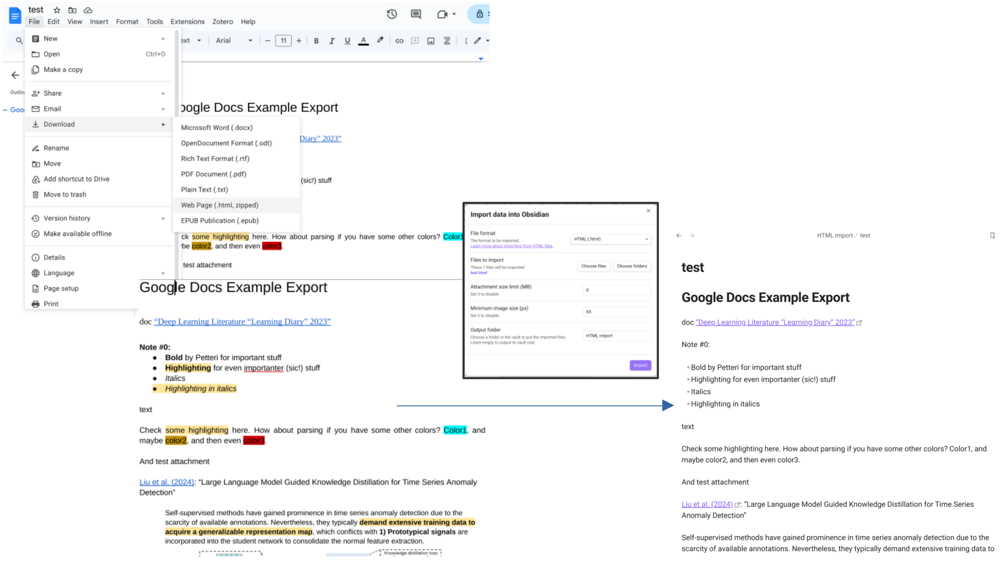
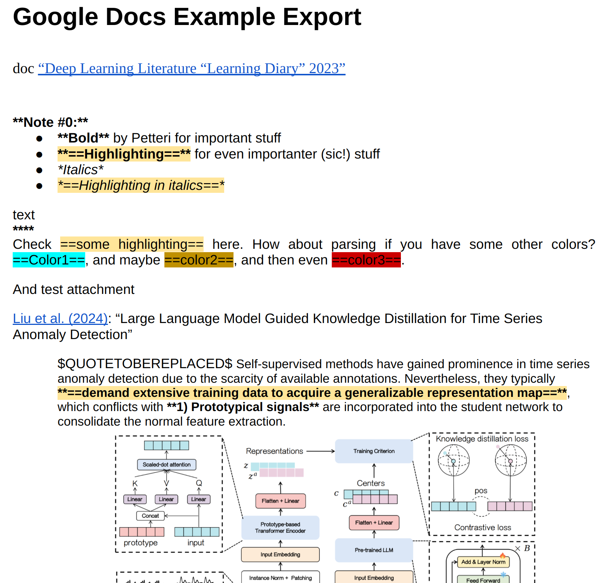
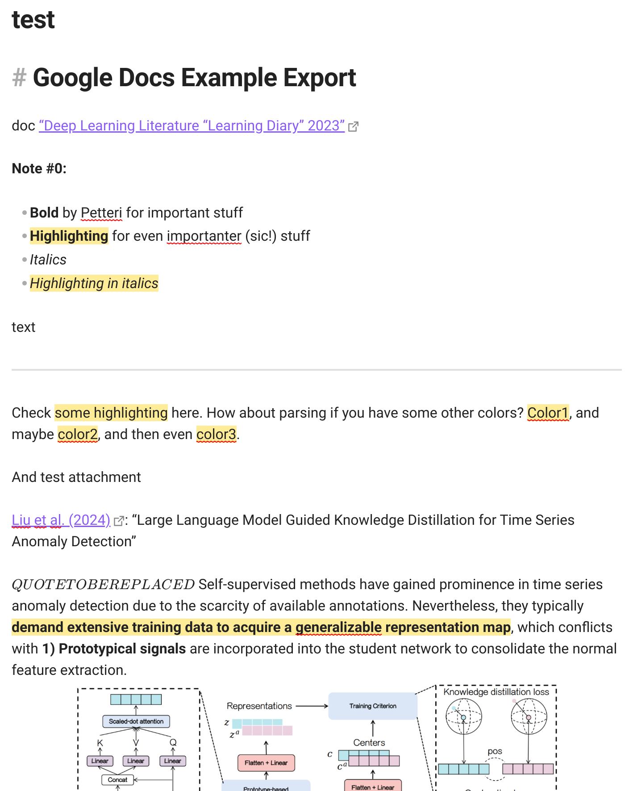
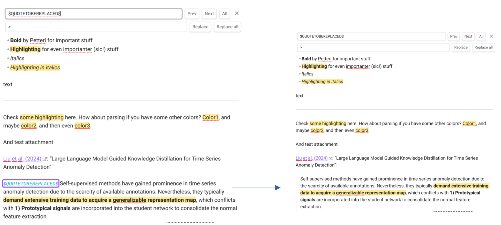

# googledocs-obsidian-import

## Problem

Google Docs (left) has all the styling correct (bold, italics, highlighting, and the indent for `quote`), but these do not get imported correctly by Obsidian importer:



## Solution

Note! Highly experimental code that worked for my style of taking Google Docs notes. Not sure if it generalizes so well, or if it is robust enough against possible changes in Google Export?

As the `css` styling in the `head` of the `html` file defines those things, we need to get the styles and add then extra markdown to exported `html` files before importing them to Obsidian.

1) Export the Google Docs file as (zipped) `html` file. Or multiple ones. And extract them somewhere.

2) Run the script `fix_gdocs_html.py` on the extracted `html` files. Point to the base directory containing "Doc1", "Doc2", etc folders:

    ```bash
    python fix_gdocs_html.py -i ./example_data
    ```
   


3) Import all the converted `html` files to Obsidian.



4) Replace the `$QUOTETOBEREPLACED$` to `> ` to get the quoted text with `fix_markdown_quotes.py` (batch process for all your files):

    ```bash
    python fix_markdown_quotes.py -i ./md_file_knowledge_base
    ``



Note! If you have different highlight colors, we only get one color now which was fine for me.

