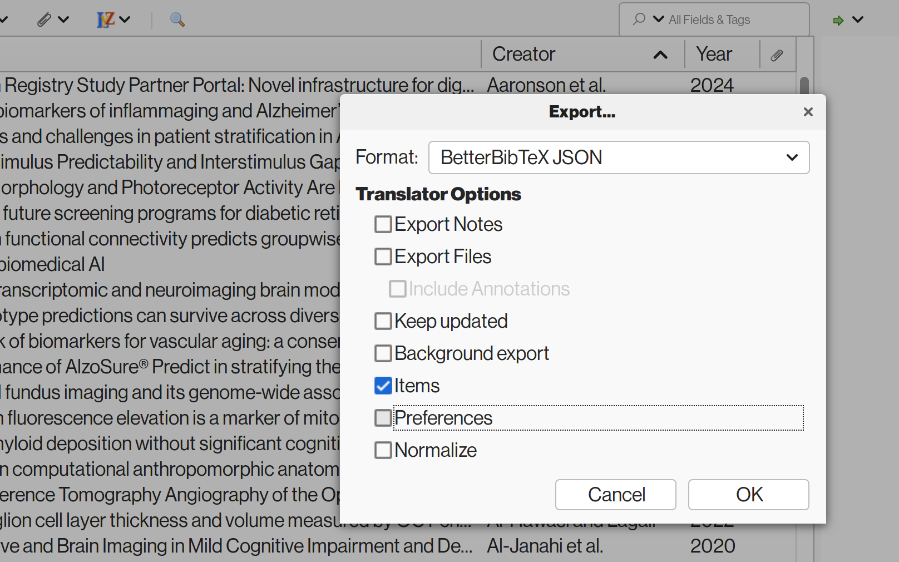

# Obsidian-ZI-Converter

Convert the BibTeX keys requiring the access to the keyboard to hardcoded Markdown links (that work for example in Obsidian Publish)

See [Export/Publish from Obsidian with Zotero Integration?](https://forum.obsidian.md/t/export-publish-from-obsidian-with-zotero-integration/81925) for background.

Note! alpha version, use at your own risk! Worked okay for my own bibliography, but hardly tested against all possible scenarios.

## Usage

* Tested with Python 3.11
* No external libraries required

1. Export your Zotero db / Zotero collection as "BetterBibTeX JSON":

> 

2. Script takes 3 arguments:Run the script with the path to the exported `.json` file as argument

* `.json` file with the bibliography entries
* folder containing your `.md` files
* _todo!_ export bibliography containing only the references used in the `.md` files (e.g. if your Zotero file is massive but you only used a subset of the entries) 

e.g.
```bash
python convert_zi_md_files.py -i /ObsidianVault/TopicFolder/attachments/biblio.json -o /ObsidianVault/out.json -md /ObsidianVault/TopicFolder/knowledge_base
```